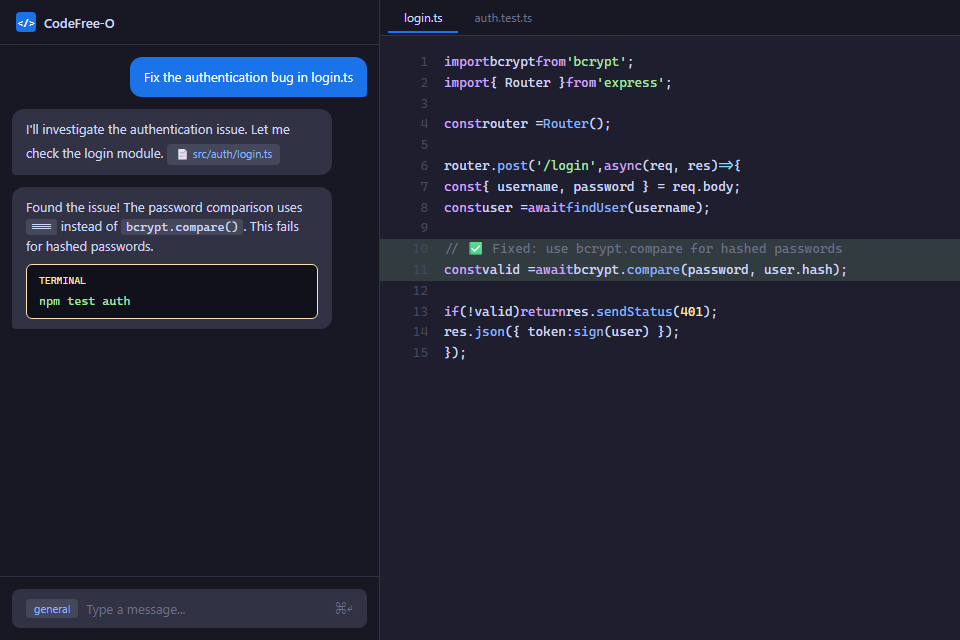

# CodeFree-O VSCode Extension (Unofficial)

A VSCode sidebar extension for [CodeFree-O](https://www.srdcloud.cn/feedback/feedback) - the AI coding agent by China Telecom. Simple chat interface to interact with CodeFree-O directly from your sidebar.



> **Note**: This is an independent community project and is not officially affiliated with or maintained by China Telecom / SRD Cloud.

## Prerequisites

1. **CodeFree-O CLI must be installed**:
   ```bash
   npm install -g @srdcloud/codefree-o
   ```

2. **CodeFree-O must be configured** with API credentials. Create or edit `~/.codefree-o/.config/codefree.json` with your provider settings.

## Development Setup

### Install Dependencies
```bash
pnpm install
```

### Build the Extension
```bash
pnpm build
```

This builds both:
- Extension code → `dist/extension.js`
- Webview UI → `out/main.js` and `out/main.css`

### Development Workflow

1. **Start watch mode** (in a terminal):
   ```bash
   pnpm watch
   ```

2. **Launch Extension Development Host**:
   - Press `F5` in VSCode/Cursor
   - Or open Run and Debug panel (`Cmd+Shift+D`) and click "Run Extension"

3. **Use the extension**:
   - Look for the CodeFree-O icon in the Activity Bar (left side)
   - Click it to open the sidebar
   - Type a message and hit Send or press Enter

### Making Changes

- **Extension code** (src/extension.ts, src/OpenCodeService.ts, src/OpenCodeViewProvider.ts):
  - Save your changes
  - Reload the Extension Development Host window: `Cmd+R` (Mac) or `Ctrl+R` (Windows/Linux)

- **Webview UI** (src/webview/App.tsx, src/webview/App.css, src/webview/hooks/):
  - Changes hot-reload automatically
  - Just save and see updates instantly

## How It Works

### Architecture

```
┌─────────────────────────────────────┐
│  SolidJS Webview (Chat UI)         │
│  - Input box                        │
│  - Message history                  │
│  - Thinking indicator               │
└──────────┬──────────────────────────┘
           │ postMessage
           ▼
┌─────────────────────────────────────┐
│  Extension Host (Node.js)           │
│  - OpenCodeService                  │
│    ├─ Manages CodeFree-O client    │
│    ├─ Creates sessions              │
│    └─ Sends prompts                 │
└──────────┬──────────────────────────┘
           │ @srdcloud/codefree-o-sdk
           ▼
┌─────────────────────────────────────┐
│  CodeFree-O Server (Bun process)    │
│  - Spawned by extension backend     │
│  - Uses workspace codefree.json     │
│  - Handles AI interactions          │
└─────────────────────────────────────┘
```

### Key Components

**Extension Side (TypeScript/ESM):**
- `src/extension.ts`: Entry point, initializes OpenCodeService
- `src/OpenCodeService.ts`: Manages CodeFree-O client/server, sessions, and prompts
- `src/OpenCodeViewProvider.ts`: Webview provider, handles message passing

**Webview Side (SolidJS):**
- `src/webview/App.tsx`: Chat UI with input, message history, thinking indicator
- `src/webview/App.css`: Styles using VSCode theme variables

**Build System:**
- `vite.config.extension.ts`: Bundles extension (ESM → CJS for VSCode)
- `vite.config.ts`: Bundles webview (SolidJS)

## Configuration

The extension automatically uses:
1. Workspace `codefree.json` (if present in project root)
2. Global CodeFree-O config at `~/.codefree-o/.config/codefree.json`

Example workspace config:
```json
{
  "$schema": "https://opencode.ai/config.json",
  "model": "anthropic/claude-3-5-sonnet-20241022",
  "mcp": {
    // MCP server configurations
  }
}
```

## Project Structure

```
codefree-o-gui/
├── src/
│   ├── extension.ts              # Extension entry point
│   ├── OpenCodeService.ts        # CodeFree-O client/server manager
│   ├── OpenCodeViewProvider.ts   # Webview provider
│   └── webview/                  # SolidJS UI
│       ├── App.tsx               # Chat component
│       ├── App.css               # Styles
│       ├── hooks/                # SolidJS hooks
│       ├── main.tsx              # SolidJS entry point
│       └── vscode.d.ts           # VSCode API types
├── media/
│   └── icon.svg                  # Activity bar icon
├── dist/                         # Compiled extension (Vite output)
├── out/                          # Compiled webview (Vite output)
├── vite.config.extension.ts      # Extension build config
├── vite.config.ts                # Webview build config
├── tsconfig.json                 # TypeScript config
└── package.json
```

## Tech Stack

- **Extension**: TypeScript (ESM), VSCode Extension API, CodeFree-O SDK
- **Webview**: SolidJS, TypeScript
- **Build**: Vite for both extension and webview
- **Styling**: CSS with VSCode theme variables
- **Server**: Bun (spawned process running CodeFree-O server)

## Features

✅ Simple chat interface
✅ Send prompts and get AI responses
✅ Thinking indicator during processing
✅ Message history (user and assistant)
✅ Workspace configuration support
✅ Full TypeScript type safety
✅ VSCode theme integration

## Future Enhancements

- Real-time streaming responses
- File attachments from workspace
- Markdown rendering in responses
- Code syntax highlighting
- Multi-session support
- Session persistence
- Undo/redo functionality

## Publishing

To publish a new version:

1. Bump the version in `package.json`
2. Set environment variable: `export OVSX_PAT=your_open_vsx_token`
3. Login to VS Code Marketplace: `npx vsce login <publisher>`
4. Run: `pnpm publish`

This publishes to both VS Code Marketplace and Open VSX Registry.

**Note**: You'll need:
- A VS Code Marketplace Personal Access Token (PAT) from Azure DevOps with "Marketplace (Manage)" scope
- An Open VSX token set as `OVSX_PAT` environment variable

## Troubleshooting

**"Failed to start CodeFree-O"**
- Install CodeFree-O CLI: `npm install -g @srdcloud/codefree-o`
- Make sure CodeFree-O CLI is installed and on PATH:
  - macOS/Linux: `which codefree-o`
  - Windows: `where codefree-o`
- Configure authentication in `~/.codefree-o/.config/codefree.json`
- If you installed CodeFree-O recently, fully restart VS Code so the extension host gets the updated PATH

**"No response received"**
- Check API credentials are valid
- Verify workspace has internet connection
- Check VSCode Developer Console for errors (Help → Toggle Developer Tools)

## Feedback & Issues

Report issues or provide feedback at: https://www.srdcloud.cn/feedback/feedback
